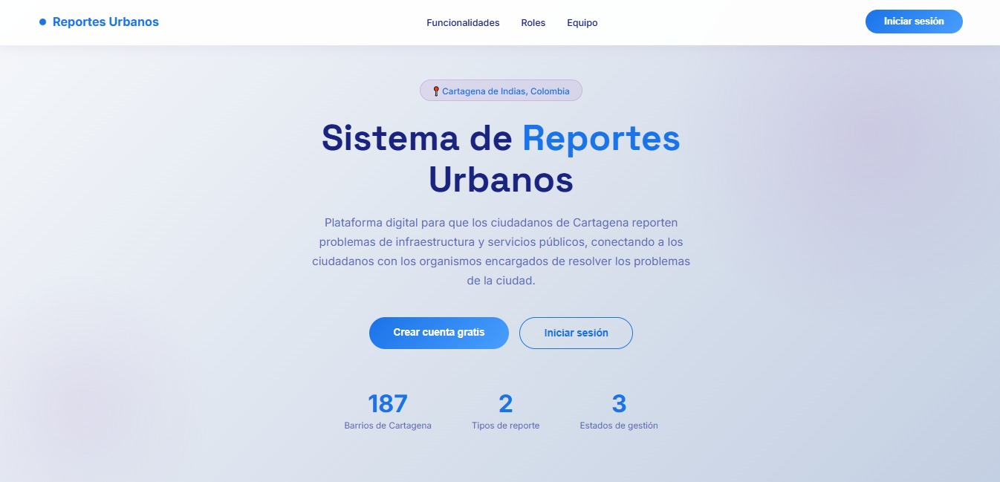
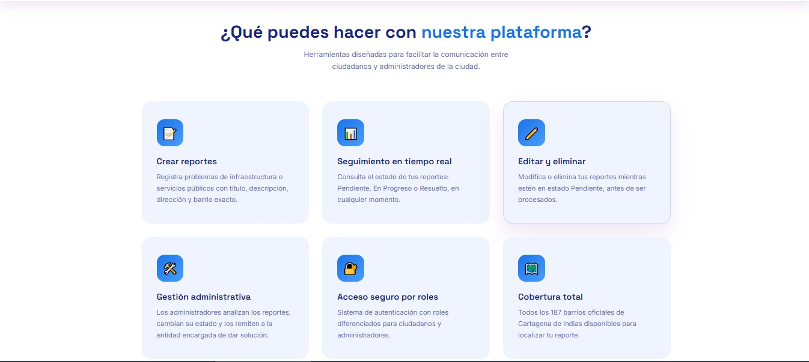
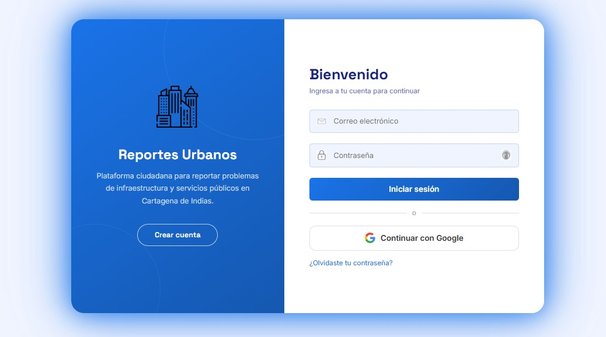
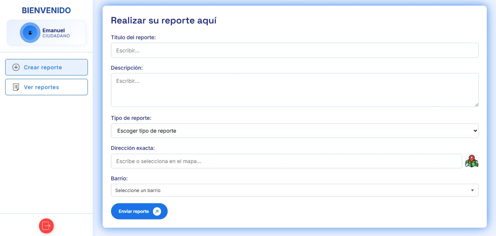
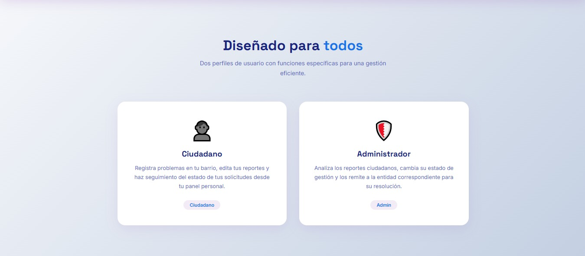
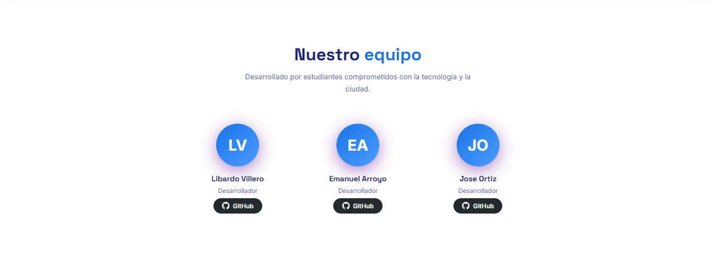

<div align="center">

# 🏙️ Urban Reports System
### *Connecting citizens with the city administration of Cartagena de Indias*

[](https://reportes-urbanos.onrender.com)
[](https://www.java.com)
[](https://spring.io/projects/spring-boot)
[](https://www.mongodb.com/atlas)
[](https://www.docker.com)

</div>

---



---

## 📋 About the Project

**Urban Reports System** is a civic web platform that allows citizens of Cartagena de Indias to report infrastructure and public service problems in their neighborhoods, connecting them directly with the administrators responsible for resolving them.

Citizens can register issues such as damaged roads, broken street lights, water service failures, and more — selecting from all **187 official neighborhoods** of Cartagena. Administrators then review, update the status, and route each report to the appropriate entity.

---

## ✨ Features



- 📝 **Create reports** with title, description, address and neighborhood
- 📊 **Real-time status tracking** — Pending, In Progress, Resolved
- ✏️ **Edit and delete** reports while in Pending status
- 🔐 **Google OAuth2 login** for easy and secure access
- 🛡️ **Role-based access control** — Citizen and Administrator roles
- 📧 **Email notifications** via SMTP when report status changes
- ⚡ **Redis caching** for improved performance
- 🗺️ **Full coverage** of all 187 neighborhoods of Cartagena de Indias
- 🐳 **Dockerized** for easy deployment

---

## 🖥️ Screenshots

| Login | Citizen Dashboard |
|-------|------------------|
|  |  |

| User Roles | Team |
|------------|------|
|  |  |

---

## 🛠️ Tech Stack

| Layer | Technology |
|-------|-----------|
| Backend | Java 21 · Spring Boot · Spring Security · OAuth2 |
| Database | MongoDB Atlas |
| Cache | Redis |
| Email | Spring Mail (SMTP Gmail) |
| Frontend | HTML · CSS · JavaScript |
| DevOps | Docker · Maven · Render |
| Version Control | Git · GitHub |

---

## 🚀 Getting Started

### Prerequisites

- Java 21
- Maven 3.9+
- Docker (optional)
- MongoDB Atlas account
- Redis instance

### Environment Variables

Create a `.env` file or set the following environment variables before running:

```env
MONGODB_URI=your_mongodb_atlas_connection_string
GOOGLE_CLIENT_ID=your_google_oauth2_client_id
GOOGLE_CLIENT_SECRET=your_google_oauth2_client_secret
ADMIN_EMAIL=your_admin_email
ADMIN_PASSWORD=your_admin_password
ADMIN_NOMBRE=your_admin_name
MAIL_USERNAME=your_gmail_address
MAIL_PASSWORD=your_gmail_app_password
REDIS_URL=your_redis_connection_url
PORT=9093
```

### Running Locally

```bash
# Clone the repository
git clone https://github.com/Libardo07/reportes-urbanos.git
cd reportes-urbanos

# Build the project
mvn clean package -DskipTests

# Run the application
java -jar target/*.jar
```

### Running with Docker

```bash
# Build the Docker image
docker build -t reportes-urbanos .

# Run the container
docker run -p 9093:9093 --env-file .env reportes-urbanos
```

The application will be available at `http://localhost:9093`

---

## 👥 User Roles


### 👤 Citizen
- Register and log in (email or Google)
- Create reports with location details
- Edit or delete their own pending reports
- Track the status of their reports in real time

### 🛡️ Administrator
- View all reports from all citizens
- Update report status (Pending → In Progress → Resolved)
- Route reports to the appropriate city entity
- Manage the platform

---

## 🌐 Live Demo

The application is deployed and fully functional at:

👉 **[https://reportes-urbanos.onrender.com](https://reportes-urbanos.onrender.com)**

---

## 👨‍💻 Team

<table align="center">
  <tr>
    <td align="center">
      <b>Libardo Villero</b><br/>
      Developer<br/>
      <a href="https://github.com/Libardo07">
        
      </a>
    </td>
    <td align="center">
      <b>Emanuel Arroyo</b><br/>
      Developer<br/>
      <a href="https://github.com/peta1308">
        
      </a>
    </td>
    <td align="center">
      <b>Jose Ortiz</b><br/>
      Developer<br/>
      <a href="https://github.com/joseoertiz-24">
        
      </a>
    </td>
  </tr>
</table>

---

<div align="center">
  <sub>Built with ❤️ by students committed to technology and the city of Cartagena de Indias 🇨🇴</sub>
</div>
